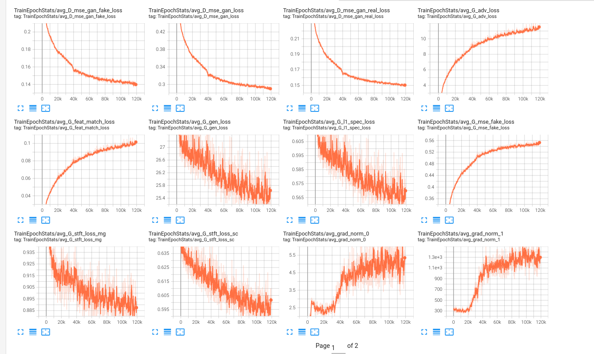

# Train_Hifigan_XTTS

This is an implementation for train hifigan part of XTTSv2 model using [**Coqui/TTS**](https://github.com/coqui-ai/TTS).

In this repo, I'm using the Ljspeech dataset for experimentation, but you can easily swap out different datasets as long as they adhere to the same format as the Ljspeech dataset. Make sure your dataset includes both audio and transcripts.

Another note is that currently, this repository only supports training the HiFi-GAN decoder while freezing the speaker encoder part. I will put this on the to-do list and complete it in the future. If you find this useful, please give me a star. Thank you!

## Download dataset and XTTSv2 checkpoint:
* Download Ljspeech dataset:
```
bash download_ljspeech.sh
```
* Download XTTSv2 checkpoint
```
sudo apt-get install git-lfs
git lfs install
git clone https://huggingface.co/coqui/XTTS-v2
```
Note that you can use the XTTSv2 checkpoint that you fine-tuned with your own data on the GPT part.
## Requirements:

* Install Coqui/TTS from source
```
git clone https://github.com/coqui-ai/TTS
pip install -e .[all,dev,notebooks]  # Select the relevant extras
```
* Install requirements
```
pip install -r requirements.txt
```

## Generate GPT Latents

Instead of using melspectrogram like conventional Hifigan, XTTSv2 utilizes GPT latents to convert into waveform format.

Run the script to generate gpt latents to "Ljspeech_latents" folder. You can custom output folder in [**generate_latents.py**](generate_latents.py).

```
python generate_latents.py
```
## Training

After generating GPT latents, we will use them to train the model.
```
python train.py
```
Since there's no pre-trained discriminator available, and the only option is to load weights from the generator, the generated sounds might be a bit noisy in the early epochs. Please be patient and wait for the later epochs; the results will improve.

## Test

You can generate audio with new hifigan decoder

```
python test.py
```

## TensorBoard

Use

```
tensorboard --logdir [output_path]
```

